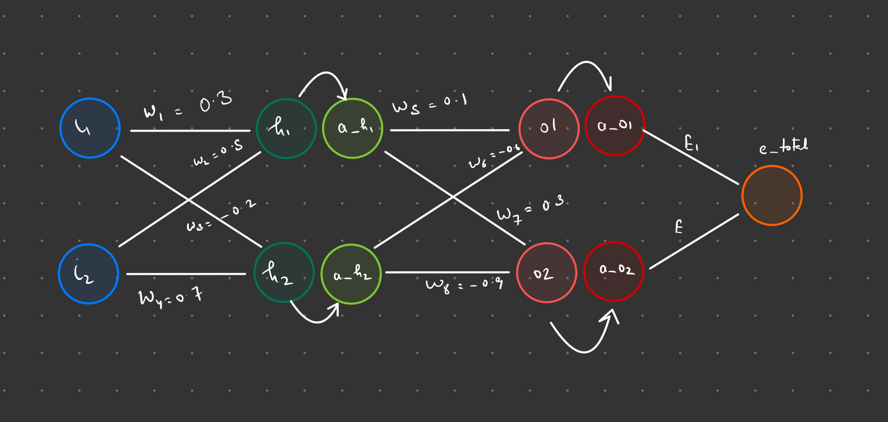
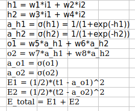
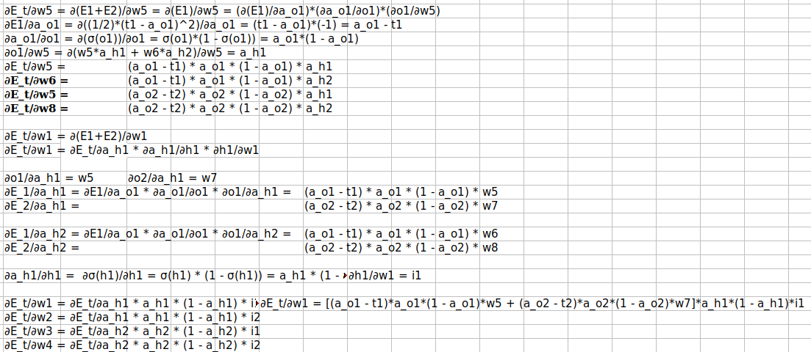
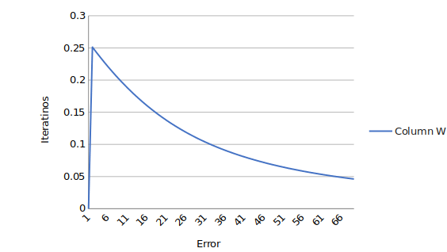

# Neural Network 

## Neural Network Diagram

## FeedForward : Calculate Errors
Feedforward equations based on the diagram above.

## Back-propagation Equations : Get Gradients

1. Gradient calculation for each of the weights :  o1 depends on w5 and w6, o2 depends on w7 and w8. Step by step calculate the error delta fosr each of the weights and solve their gradient.

2. Chain rules says that  if  a variable ***E_total\*** depends on the variable ***a_o1\***, which itself depends on the variable ***h1\***, so that *E_total* and *a_o1* are dependent variables, then *zE_total*, via the intermediate variable of *a_o1*, depends on *h1* as well. Hence we need to calculate the gradients of  weights of neurons h1 and h2 or weights w1, w2,w3 and w4.

---

## Network - Lifecycle

1. We first calculate the forward propagation based on the random weights or in this case weights assigned.
2. We calculate two  hidden layers and hence the output.
3. Loss Function : Calculate the T_error by comparing outputs with Targets.
4. We see loss  value  as an output and want to minimise the loss and hence want to correct the weights assigned, hence rectify the network.
5. Backward Prop : Use backward pass equation to get gradients for each weight against the error calculated.
6. Reduce the weight values by the corresponding gradient values.
7. Move to next iteration with the weights from step6.
8. Repeat until we reach desirable output.

## Results

